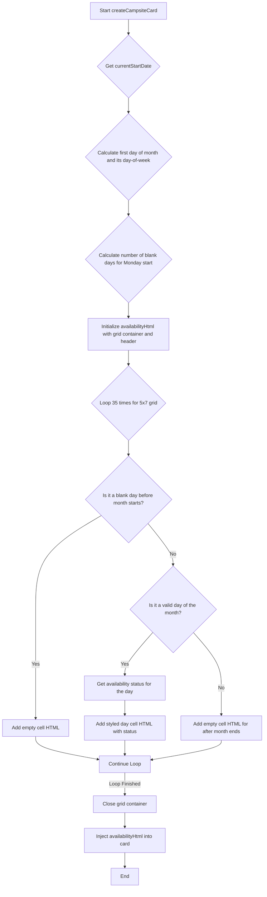

# Plan to Redesign the Availability Calendar

This plan outlines the steps to transform the current linear daily availability view into a 7x5 weekly grid calendar, starting on Monday.

## 1. Update JavaScript Logic in `frontend/js/ui.js`

The core of the change will be within the `createCampsiteCard` function in `frontend/js/ui.js`. The existing `for` loop for availability will be replaced with new logic to build the grid.

### New Logic Outline:

1.  **Calculate Grid Start:**
    *   Get the first day of the selected month.
    *   Determine the day of the week for the first day (e.g., Wednesday).
    *   Calculate the number of "padding" days needed at the beginning of the calendar to make the week start on a Monday. For example, if the month starts on a Wednesday, we need 2 empty cells for Monday and Tuesday. The logic will adjust JavaScript's `getDay()` (where Sunday is 0) to a Monday-first week.

2.  **Generate Grid Cells:**
    *   Create a loop that runs for the total number of cells in the grid (5 weeks * 7 days = 35 cells).
    *   Inside the loop:
        *   For padding days, render an empty, disabled-looking cell.
        *   For actual days of the month, render a cell with the day number and its availability status (Available, Reserved, Unknown).
        *   For days after the end of the month, render more empty, disabled-looking cells to fill out the grid.

3.  **HTML Structure for the Grid:**
    *   The `availabilityHtml` will be structured using a main container with `display: grid` and 7 columns.
    *   A header row for the days of the week (Mon, Tue, Wed, Thu, Fri, Sat, Sun) will be added.

### Mermaid Diagram of the new `createCampsiteCard` availability logic:

## 2. Update CSS in `frontend/css/style.css`

The CSS will be modified to support the new grid layout.

1.  **Modify `.daily-availability`:**
    *   Change `grid-template-columns` to `repeat(7, 1fr)` to create a strict 7-column layout.
    *   Remove `repeat(auto-fit, minmax(25px, 1fr))`.

2.  **Add New Styles:**
    *   Create a style for the calendar header cells (`.day-header`).
    *   Create a style for the empty/padding cells (`.empty-day`) to make them visually distinct.
    *   Ensure the `.day-cell` styles work well within the new fixed grid.

## 3. No Changes to `index.html` or `main.js`

The changes are contained within the component generation (`ui.js`) and its styling (`style.css`), so no changes are anticipated for `frontend/index.html` or `frontend/js/main.js`.