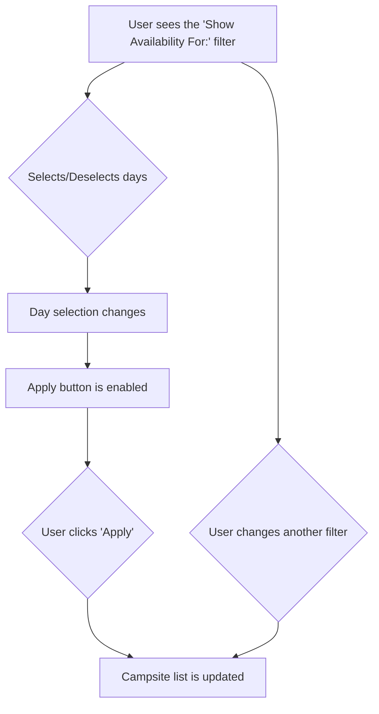

# Plan: Multi-Day Availability Filter

This document outlines the plan to update the "days availability" filter to allow for multiple day selections with a manual "Apply" button.

## 1. Proposed Solution

The proposed solution is to enhance the existing day selection UI by adding an "Apply" button. This will give users explicit control over when the filter is applied, improving the overall user experience.

- **UI:** Keep the current toggle-style buttons for days of the week.
- **Interaction:** Remove the automatic filtering on `mouseup` and trigger filtering only when the new "Apply" button is clicked.

## 2. User Flow



## 3. Implementation Details

### `frontend/index.html`

- **Add "Apply" button:**
  In the `filter-group` for the day selector, add a button:
  ```html
  <div class="filter-group">
      <label>Show Availability For:</label>
      <div id="days-of-week-filter" class="day-selector">
          <div class="day-box" data-day="1">Mon</div>
          <div class="day-box" data-day="2">Tue</div>
          <div class="day-box" data-day="3">Wed</div>
          <div class="day-box" data-day="4">Thu</div>
          <div class="day-box" data-day="5">Fri</div>
          <div class="day-box" data-day="6">Sat</div>
          <div class="day-box" data-day="0">Sun</div>
      </div>
      <button id="apply-days-filter" class="ml-2" disabled>Apply</button>
  </div>
  ```

### `frontend/css/style.css`

- **Style the "Apply" button:**
  Add the following CSS to style the new button and its disabled state:
  ```css
  #apply-days-filter {
      background-color: #4a5568;
      border-color: #63b3ed;
      transition: background-color 0.2s ease;
      padding: 8px 12px;
      border-radius: 8px;
      font-size: 0.9rem;
      cursor: pointer;
      height: 40px;
  }

  #apply-days-filter:hover:not(:disabled) {
      background-color: #63b3ed;
      color: #1b1c1d;
  }

  #apply-days-filter:disabled {
      opacity: 0.5;
      cursor: not-allowed;
  }
  ```

### `frontend/js/main.js`

- **Get reference to the new button:**
  ```javascript
  const applyDaysFilterButton = document.getElementById('apply-days-filter');
  ```

- **Modify event listeners:**
  - Remove the `applyFilters()` call from the `mouseup` event listener.
  - Add a `click` listener to the new button.
  - Enable the button when a day selection is made.

  The updated event listener section should look like this:

  ```javascript
  // (keep the existing isDragging and startDay variables)

  daysOfWeekFilter.addEventListener('mousedown', (e) => {
      if (e.target.classList.contains('day-box')) {
          isDragging = true;
          const day = parseInt(e.target.dataset.day, 10);
          startDay = day;
          
          if (!e.shiftKey) {
              daysOfWeekFilter.querySelectorAll('.day-box').forEach(box => box.classList.remove('selected'));
          }
          
          e.target.classList.toggle('selected');
          applyDaysFilterButton.disabled = false; // Enable button
          e.preventDefault();
      }
  });

  daysOfWeekFilter.addEventListener('mouseover', (e) => {
      if (isDragging && e.target.classList.contains('day-box')) {
          const currentDay = parseInt(e.target.dataset.day, 10);
          const dayBoxes = Array.from(daysOfWeekFilter.querySelectorAll('.day-box'));
          const startIndex = dayBoxes.findIndex(box => parseInt(box.dataset.day, 10) === startDay);
          const currentIndex = dayBoxes.findIndex(box => parseInt(box.dataset.day, 10) === currentDay);

          dayBoxes.forEach(box => box.classList.remove('selected'));

          const min = Math.min(startIndex, currentIndex);
          const max = Math.max(startIndex, currentIndex);

          for (let i = min; i <= max; i++) {
              dayBoxes[i].classList.add('selected');
          }
          applyDaysFilterButton.disabled = false; // Enable button
      }
  });

  window.addEventListener('mouseup', () => {
      if (isDragging) {
          isDragging = false;
          startDay = -1;
          // No longer call applyFilters() here
      }
  });

  applyDaysFilterButton.addEventListener('click', () => {
      applyFilters();
      applyDaysFilterButton.disabled = true; // Disable after applying
  });
  ```

- **Update `resetFilters` function:**
  Add a line to disable the "Apply" button when filters are reset.
  ```javascript
  function resetFilters() {
      // ... (existing code)
      applyDaysFilterButton.disabled = true; // Add this line
      handleApiParamsChange();
  }