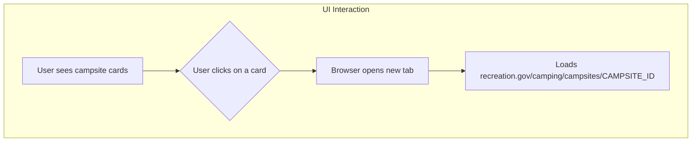

# Plan: Make Campsite Cards Clickable

The goal is to transform each campsite card into a clickable link that directs the user to the specific campsite page on `recreation.gov` in a new browser tab.

## UI Interaction Flow



## Implementation Steps

```mermaid
graph TD
    subgraph "Implementation Steps"
        E[Modify `createCampsiteCard` function in `ui.js`] --> F[Wrap the card's HTML in an `<a>` tag];
        F --> G[Set `href` to "https://recreation.gov/..." with the campsite ID];
        G --> H[Set `target="_blank"` to open in a new tab];
        H --> I[Add a CSS class to the link for styling];
        I --> J[Adjust CSS in `style.css` to remove default link styling];
    end
```

### Detailed Steps:

1.  **Modify `createCampsiteCard` in `frontend/js/ui.js`:**
    *   Change the root element of the card from a `<div>` to an anchor `<a>` tag.
    *   The `href` attribute will be dynamically constructed using the campsite's ID: `https://www.recreation.gov/camping/campsites/${campsite.campsite_id}`.
    *   To ensure the link opens in a new tab, add the `target="_blank"` attribute.
    *   For security best practices, `rel="noopener noreferrer"` will also be added.

2.  **Update CSS in `frontend/css/style.css`:**
    *   By default, browsers style anchor tags with blue text and an underline. To maintain the card's original appearance, add a new CSS rule to reset these styles for the campsite card links. Apply a class like `.campsite-link` to the anchor tag and target it with CSS to ensure other links on the page are not affected.